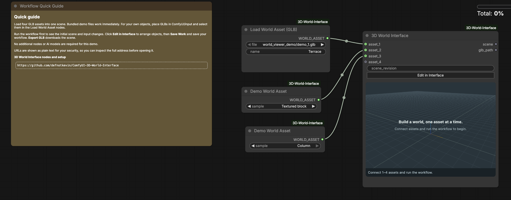
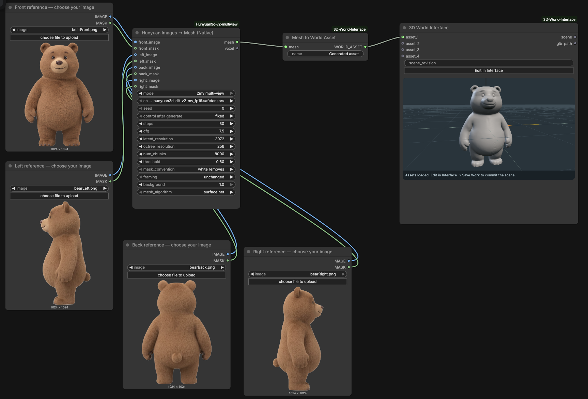
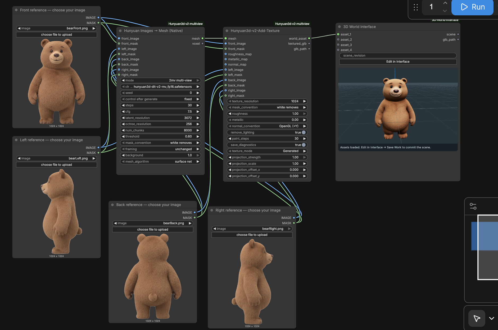
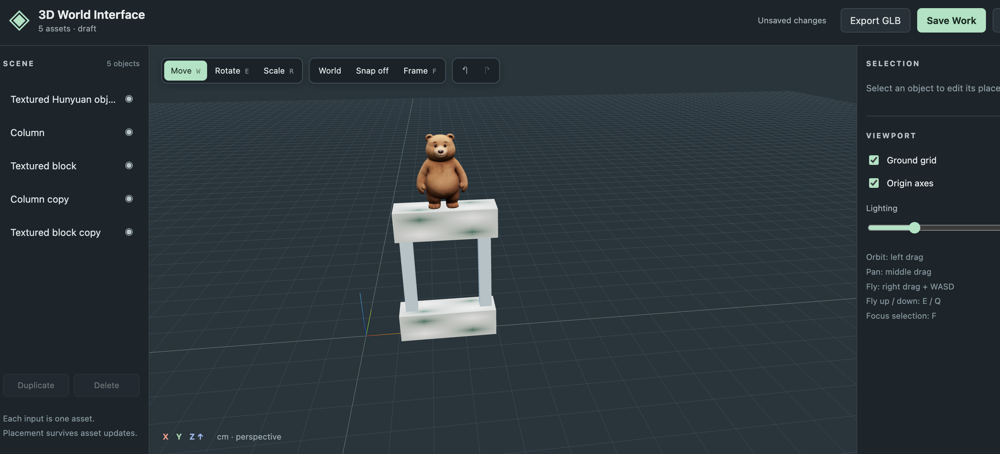
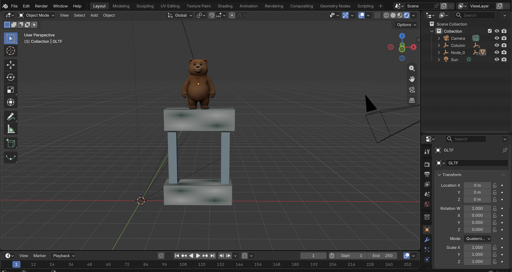

# ComfyUI-3D-World-Interface

## Video Tutorial

[Set up Hunyuan Multiview and 3D World Interface in ComfyUI on RunPod](https://www.youtube.com/watch?v=DBkhDIWaYBw)

## Intro

Bring up to four 3D assets into one scene inside ComfyUI. **3D World Interface** lets you move, rotate, scale, and duplicate objects, save your layout, and export the assembled scene as a GLB for Blender or another 3D application.

Use existing GLB files or connect generated meshes from [ComfyUI-Hunyuan3d-v2-multiview](https://github.com/defnotkevin/ComfyUI-Hunyuan3d-v2-multiview). No AI model downloads are required for the World Interface itself.

### Add Your Objects

Put your GLB files in `ComfyUI/input` or a subfolder. Add a **Load World Asset (GLB)** node for each GLB object and connect its output to `asset_1` through `asset_4` on **3D World Interface**. Add premade demo objects using the **Demo World Asset Node** and select from the sample drop down which object you want to add.



For generated geometry, connect `mesh` through **Mesh to World Asset**. 



For textured Hunyuan assets, connect the Add Texture node's `world_asset` output directly to the interface. The textured Hunyuan asset generating node can be found in the [ComfyUI-Hunyuan3d-v2-multiview](https://github.com/defnotkevin/ComfyUI-Hunyuan3d-v2-multiview) repository (https://github.com/defnotkevin/ComfyUI-Hunyuan3d-v2-multiview).



Run the workflow, then click **Edit in Interface** to open up the interactive 3D World. I added the pillars and blocks from the demo assets and arranged them in the example below.



### Arrange Your Scene

Select an object in the viewport or object list. Use the move, rotate, and scale tools or enter values in the numeric fields. Duplicate objects to create additional instances and use **Place on ground** to snap them onto the floor level.

### Saving Your Work

Click **Save Work** to commit the layout, then save your ComfyUI workflow to retain its updated scene revision. Run again when you want downstream nodes to receive the saved scene.

Back up both your workflow JSON and `ComfyUI/output/world_viewer`. The workflow does not contain the model files. On RunPod and other Manual ComfyUI setups, you will need to keep this folder on persistent storage.

### Export as a GLB

Click **Export GLB** in the editor. To bring it into another 3D software, simply drag and drop the file into your viewport. Here is an example using Blender.



The export preserves supported geometry, materials, and object placements. However, it doesn't preserve grid lines, gizmos, and preview lighting from the 3D World Interface node.

## Requirements

- A working ComfyUI installation and a browser with WebGL support.
- Enough local graphics memory for your scene.
- Static GLB files with embedded textures, or single-item native ComfyUI `MESH` inputs.

## Nodepack Setup

### ComfyUI Desktop Setup

1. Locate the user data/install directory selected during ComfyUI Desktop setup, containing `custom_nodes` and `models`.
2. Close ComfyUI.
3. Clone this repository into `custom_nodes`, or download the GitHub ZIP and extract it there.
4. Ensure the layout is `custom_nodes/ComfyUI-3D-World-Interface/__init__.py`, in order to avoid an extra nested repository folder.
5. Restart ComfyUI and reload its interface.
6. Open the **built-in demo** below, click **Run**, then **Edit in Interface**.

### Setup through GitHub (Manual ComfyUI / RunPod)

Use your ComfyUI installation path in place of `/workspace/ComfyUI` if different.

```bash
cd /workspace/ComfyUI/custom_nodes
git clone https://github.com/defnotkevin/ComfyUI-3D-World-Interface.git
```

Then:

1. Restart ComfyUI and hard refresh the browser.
2. Open a ready made workflow below.
3. Click **Run**, then **Edit in Interface** to arrange the objects.

To update an existing clone:

```bash
cd /workspace/ComfyUI/custom_nodes/ComfyUI-3D-World-Interface
git pull --ff-only
```

Restart ComfyUI and hard refresh afterward. Keep only one installed copy. When replacing an older ZIP installation, move its folder outside `custom_nodes` first.

## Ready Made Workflows

Download a JSON below using GitHub **Raw / Download raw file**, then drag it into ComfyUI.

| Workflow | Connections | Setup |
|---|---|---|
| [Built-in demo](example_workflows/built_in_demo.json) | Four Demo World Asset nodes → 3D World Interface | Ready to run with bundled sample assets. No models or file copying needed |
| [Four GLB assets](example_workflows/four_assets.json) | Four Load World Asset nodes → 3D World Interface | Bundled demo GLBs load automatically, or select your own GLBs from `ComfyUI/input` |

For Image-to-3D generation, install [ComfyUI-Hunyuan3d-v2-multiview](https://github.com/defnotkevin/ComfyUI-Hunyuan3d-v2-multiview) separately. Its [textured scene workflow](https://github.com/defnotkevin/ComfyUI-Hunyuan3d-v2-multiview/blob/main/example_workflows/texture_four_views_to_world.json) connects directly to this interface.

To send a saved scene to ComfyUI's native saving node, connect:

```text
3D World Interface / scene → World Scene to GLB → Save 3D Model
```

Click **Save Work**, then run again. Before the first save, **World Scene to GLB** waits for a committed scene.

## Node References

Below are all the nodes included in this repository.

| Display name / Internal ID | Purpose | Inputs | Outputs |
|---|---|---|---|
| **3D World Interface** / `WorldViewer` | Arrange assets, save layouts, and export a scene | Up to four `WORLD_ASSET` inputs and `scene_revision`, managed by Save Work | `scene` (`WORLD_SCENE`), `glb_path` (`STRING`) |
| **Load World Asset (GLB)** / `LoadWorldAsset` | Load an existing GLB from the ComfyUI input folder | File and asset name | `WORLD_ASSET` |
| **Mesh to World Asset** / `MeshToWorldAsset` | Convert one native mesh into an input asset | `mesh` (`MESH`) and asset name | `WORLD_ASSET` |
| **World Scene to GLB** / `WorldSceneGLB` | Pass a committed scene to compatible native saving nodes | `scene` (`WORLD_SCENE`) | `FILE_3D_GLB` |
| **Demo World Asset** / `DemoWorldAsset` | Load a bundled sample without generation | Terrace, Pavilion, Textured block, or Column | `WORLD_ASSET` |

### Editor Controls

| Action | Control |
|---|---|
| Orbit / pan / zoom | Left drag on empty space / middle drag / mouse wheel |
| Fly | Hold right mouse and use W/A/S/D, with Q/E for down/up |
| Faster Flight | Hold Shift while flying |
| Move / Rotate / Scale an object | W / E / R when not flying |
| Frame Selection or Scene | F |
| Undo / Redo | Ctrl/Cmd+Z / Ctrl/Cmd+Shift+Z |
| Delete Selection | Delete |
| Close Editor | Escape or Close |

### Important Controls and Limitations

- **Scale:** Position fields use centimeters and rotation uses degrees. Asset sizes are not normalized automatically. Use scale fields to match objects to one another.
- **Input Updates:** Replacing an input asset preserves its scene placement, but disconnecting an input does not delete its existing objects automatically.
- **Saving:** `glb_path` is a server path and stays empty until the first Save Work. Saved revisions and assets remain under `output/world_viewer`, with no automatic cleanup.
- **Objects:** Four input slots support up to 256 scene objects through duplication. Hidden objects are omitted from GLB output.
- **Formats:** Rigged or animated assets, external texture files, Draco/Meshopt/KTX2 compression, and OBJ/FBX/Blend/USD imports are not supported.
- **Size:** Individual asset files and saved GLBs are limited to 256 MiB. Server upload limits and local graphics memory may impose lower limits.
- **Editing:** Mesh sculpting, per part editing, texture painting, custom lights, and camera/image outputs are not included in this current version of the 3D World Interface Nodepack.

### Quick Troubleshooting

- **Node Missing:** Check the startup log and confirm the repository is not nested inside another folder.
- **Blank Viewport:** Try the built in demo and check the browser console for WebGL errors.
- **GLB Missing from the List:** Put it in the configured ComfyUI input folder and refresh the interface.
- **Saved Scene Missing:** Restore both the workflow and its `output/world_viewer` folder.
- **Export Looks Different:** The viewport lighting is not part of the export. Blender and other softwares use their own lighting. 

## Development Credits

Built on [ComfyUI](https://github.com/Comfy-Org/ComfyUI) and [Three.js](https://github.com/mrdoob/three.js). Bundled Three.js 0.180.0 is distributed under its [MIT license](ui/vendor/LICENSE).

This is an independent community project, not an official ComfyUI or Tencent product.
